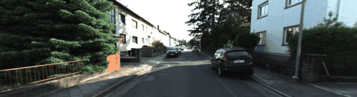
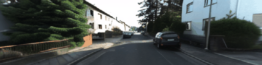
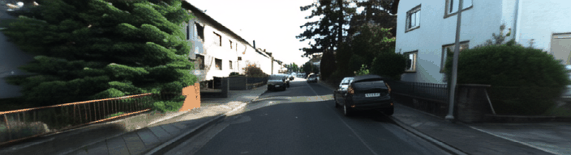
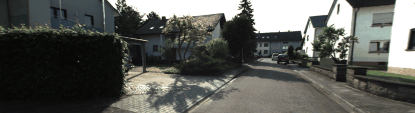
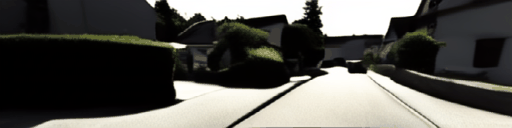
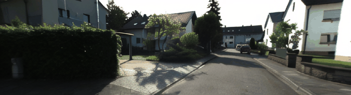
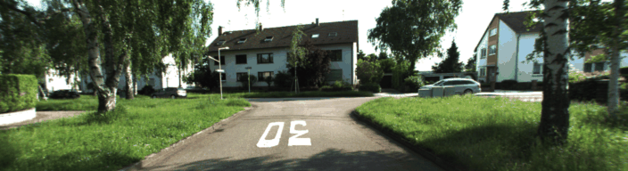
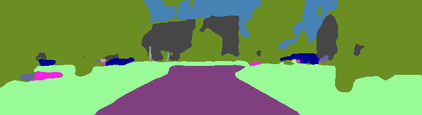
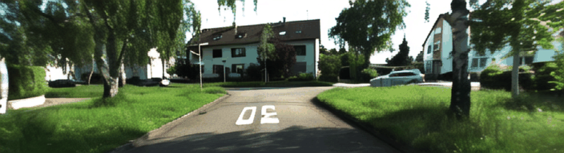

# Ctrl-V-Seg: Semantic-Conditioned Autonomous-Vehicle Video Generation

**Ctrl-V-Seg** is a two-stage video diffusion system for autonomous-vehicle scenes on KITTI-360.
Instead of conditioning generation on bounding-box layouts (as in the original Ctrl-V , where they encode control signals on RGB VAE), we condition
on **dense semantic segmentation maps** at every pixel, producing tighter scene control and
photorealistic rollouts that are directly evaluable with off-the-shelf segmentation models.

The codebase extends Stable Video Diffusion (SVD-XT) with two trainable stages and a dedicated
semantic VAE:

| Stage | Direction | Purpose | Backbone |
|---|---|---|---|
| **Stage 1 — Semantic Predictor** | RGB → semantic maps | Given the first RGB frame, predict a 25-frame future of semantic segmentation in latent space | SVD-XT UNet |
| **Stage 2 — Sem2Video ControlNet** | semantic maps → RGB | Generate photorealistic RGB video conditioned on a semantic map sequence | SVD-XT + ControlNet |

The two stages are trained independently and then chained at inference: Stage 1 predicts the
semantic future from a single RGB frame, and Stage 2 turns that future back into video.

---

## Demo

Side-by-side rollouts at three randomly-chosen KITTI-360 validation clips
(GIFs in [`output_gif/`](./output_gif)):

| Index | Ground truth | Original Ctrl-V (bbox) | **Ctrl-V-Seg Stage 1** (RGB → semantic) | **Ctrl-V-Seg Stage 2** (semantic → RGB) |
|:---:|:---:|:---:|:---:|:---:|
| 00 |  |  |  |  |
| 20 |  |  |  |  |
| 35 |  |  |  |  |

---

## Headline Results (KITTI-360 val)

**Semantic VAE** — encode/decode fidelity on 100 KITTI-360 val clips. Final configuration is
the *Semantic-Native* VAE trained with boundary-weighted CE (α=4.0) and Dice loss (λ=0.5):

| Configuration | Trainable Params | mIoU ↑ | Pixel Acc ↑ |
|---|---|---|---|
| RGB VAE baseline (no training) | 0 | 54.3 % | 97.7 % |
| Adapter + boundary loss (α=8.0) | 14 K | 79.5 % | 99.3 % |
| **Semantic-Native + Dice (final)** | **200 K** | **89.7 %** | **99.0 %** |

**Stage 1 — semantic video prediction** (checkpoint step 10 200, 170 val clips ×
25 frames = 4 250 frames, 30 denoising steps, single-scale label-space comparison):

| Metric | Value |
|---|---|
| mIoU | **40.01 %** |
| Pixel accuracy | 80.84 % |
| Mean class accuracy | 53.52 % |
| Frequency-weighted IoU | 68.75 % |

**Stage 2 — semantic-to-video generation.** DRN-based mIoU is computed under the
*multi-scale, confidence-weighted DRN-D-105 protocol* (six scales × 19 clip groups × 25 frames =
475 frames); image and video quality metrics use 487 val clips at 192×704, 25 frames each.

| Variant | DRN mIoU (MS) ↑ | Pixel Acc ↑ | Mean Acc ↑ | FW-IoU ↑ | FID ↓ | LPIPS ↓ | SSIM ↑ | PSNR ↑ | FVD-I3D ↓ |
|---|---|---|---|---|---|---|---|---|---|
| Frozen UNet baseline (step 96 100) | 23.20 % | 67.63 % | 37.10 % | 52.29 % | — | — | — | — | — |
| **UNet unfreeze (step 32 700)** | **50.64 %** | **85.34 %** | **50.88 %** | **75.31 %** | 21.91 | **0.357** | **0.443** | **14.62** | 255.21 |
| UNet unfreeze + multi-scale reinjection | 43.69 % | 83.41 % | 46.63 % | 72.61 % | **20.96** | 0.374 | 0.414 | 13.82 | **234.31** |

The +27.4 pp jump in DRN mIoU (23.20 → 50.64 %) from selectively unfreezing the SVD UNet
mid-block + output projection (~15–20 % of UNet parameters) is the single largest improvement
observed in this work, and is achieved at less than half the training steps of the frozen
baseline. Multi-scale semantic reinjection (refreshing the semantic latent at the 12×44, 6×22
and 3×11 ControlNet encoder stages via zero-init projections) trades a small amount of per-frame
semantic precision for better global realism (lower FID) and temporal consistency (lower FVD).

**Comparison with reference methods** (numbers are not strictly comparable — dataset, control
modality, and resolution differ; mIoU is from the same multi-scale DRN-D-105 procedure):

| Method | Dataset / Control | FID ↓ | FVD ↓ | mIoU ↑ | LPIPS ↓ | SSIM ↑ | PSNR ↑ |
|---|---|---|---|---|---|---|---|
| SVS-GAN (Seyam et al., 2024) | KITTI-360 / semantic | **19.63** | **176.89** | **53.89 %** | — | — | — |
| Ctrl-V — teacher-forced Box2Video (Luo et al., 2025) | KITTI / bbox | — | 435.60 | 30.48 % | **0.296** | 0.439 | 14.10 |
| **Ours — UNet unfreeze** | KITTI-360 / semantic | 21.91 | 255.21 | 50.64 % | 0.357 | **0.443** | **14.62** |
| **Ours — + multi-scale reinjection** | KITTI-360 / semantic | 20.96 | 234.31 | 43.69 % | 0.374 | 0.414 | 13.82 |

The +20 pp DRN-mIoU gap over Ctrl-V's box-conditioned Box2Video, computed with an identical
DRN-D-105 procedure, validates dense semantic conditioning over sparse layout cues. The
remaining ~3 pp deficit to SVS-GAN is consistent with the deterministic pixel-level
optimisation of GAN-based methods compared with the stochastic denoising objective of latent
diffusion.

Full per-class IoUs, per-clip mIoU, multi-scale DRN reports, and JSON dumps are in
[`docs/eval_results/`](./docs/eval_results); the corresponding write-up is in
[`iss_rp_paper/`](../iss_rp_paper) (Chapter 4).

---

## Companion Repositories

Ctrl-V-Seg is one of four repositories that together make up this thesis project. The companion
repos sit alongside `Ctrl-V-Seg/` in the top-level workspace:

```
workspace/
├── Ctrl-V-Seg/        # this repo — Stage 1 + Stage 2 video diffusion
├── vae_semantic/      # the semantic VAE used by both stages
├── drn/               # Dilated Residual Network segmenter for Stage 2 mIoU evaluation
└── iss_rp_paper/      # written report / paper sources
```

- **`vae_semantic/`** — Trains the `SemanticVAENative` U-Net VAE that encodes 19-class
  one-hot semantic maps into 4-channel SVD-compatible latents and decodes them back to logits.
  Both Stage 1 and Stage 2 load the checkpoint produced here.
- **`drn/`** — A fork of Yu et al.'s [Dilated Residual Networks](https://github.com/fyu/drn)
  fine-tuned on KITTI-360. Used as the *external* segmenter that scores Stage 2's RGB output
  back into semantic maps for the DRN-mIoU metric. The Stage 2 evaluation pipeline calls into
  this folder via [`drn_eval/`](./drn_eval) (a copy of the runtime pieces).
- **`iss_rp_paper/`** — Report sources (LaTeX, figures, tables).

---

## Installation

```bash
conda create -n kitti python=3.10
conda activate kitti

# PyTorch with CUDA 12.1
conda install pytorch torchvision pytorch-cuda=12.1 -c pytorch -c nvidia

pip install -r requirements.txt
python setup.py develop

python -c "import torch; print('CUDA:', torch.cuda.is_available())"
python -c "import ctrlv; print('ctrlv installed')"
```

Key dependencies (full list in [`requirements.txt`](./requirements.txt)):
`diffusers==0.27.2`, `accelerate==0.30.0`, `transformers==4.40.0`, `pytorch_lightning==2.2.0`,
`lpips`, `wandb`, `cdfvd` (for FVD-I3D).

---

## Dataset

We train and evaluate on the **KITTI-360 official release** — no preprocessing required. The
dataset class `KITTI360OfficialDataset` (`src/ctrlv/datasets/kitti360_official.py`) reads
directly from the official directory layout:

```
KITTI-360/
├── data_2d_raw/{sequence}/image_00/data_rect/*.png            # RGB frames
└── data_2d_semantics/train/
    ├── {sequence}/image_00/semantic/*.png                      # grayscale semantic maps
    ├── 2013_05_28_drive_train_frames.txt                       # train split
    └── 2013_05_28_drive_val_frames.txt                         # val split
```

Set `KITTI360_DATA_ROOT` (or the `--dataset_root` flag in the train scripts) to point to your
local KITTI-360 root. KITTI-360 raw label IDs are remapped to 19 continuous Cityscapes-style
trainIds inside `src/ctrlv/utils/semantic_preprocessing.py`.

---

## Training

All three components — Semantic VAE, Stage 1, Stage 2 — are trained independently in fp16
with gradient checkpointing on a single A5000/A6000-class GPU (≤ 48 GB VRAM). Stage 2 uses
ground-truth semantic maps for conditioning during training and can be run in parallel with
Stage 1.

| Component | Resolution | Clip | Batch (eff.) | LR | Epochs | Notes |
|---|---|---|---|---|---|---|
| Semantic VAE | 192×704 | 4 frames | 1 | 1e-3 | up to 50 (early stop on val mIoU) | 200 K trainable params over a frozen 84 M-param SVD VAE; cosine LR with 500-step warmup; α = 4.0 boundary CE + 0.5 Dice |
| Stage 1 | 192×704 | 25 frames | 1 (×6 grad-accum) | 5e-6 | 10 | conditioning dropout 0.1, train guidance ∈ [3, 7] |
| Stage 2 | 192×704 | 25 frames | 1 (×4 grad-accum) | 1e-5 (CN), 5e-6 (UNet) | 10 | trains ControlNet + selectively unfrozen UNet mid-block & output projection (~15–20 % UNet params); train guidance ∈ [1, 3] |

See `docs/semantic_vae/TRAINING_GUIDE.md`, `docs/guides/KITTI360_TRAINING_GUIDE.md`, and
`scripts/train_scripts/README_TRAINING.md` for the full hyperparameter tables and SLURM
launchers.

### Stage 1 — Semantic Predictor

```bash
sbatch scripts/train_scripts/train_kitti360_bbox_predict.sh
```

Or run directly:

```bash
accelerate launch tools/train_video_diffusion.py \
    --pretrained_model_name_or_path stabilityai/stable-video-diffusion-img2vid-xt \
    --dataset_name kitti360_official \
    --predict_bbox --use_segmentation --num_cond_bbox_frames 1 \
    --clip_length 25 --train_H 192 --train_W 704 \
    --learning_rate 5e-6 --train_batch_size 1 --gradient_accumulation_steps 6 \
    --mixed_precision fp16 --variant fp16 \
    --output_dir $OUT_DIR --report_to wandb
```

`--use_segmentation` switches the dual-VAE pathway on: the SVD RGB VAE encodes the conditioning
frame, while the `SemanticVAENative` checkpoint (from the `vae_semantic/` repo) encodes/decodes
the semantic targets.

### Stage 2 — Sem2Video ControlNet

```bash
sbatch scripts/train_scripts/train_kitti360_sem2video.sh
# unfreezing the SVD UNet for joint fine-tuning:
sbatch scripts/train_scripts/train_kitti360_sem2video_unet_unfreeze.sh
```

```bash
accelerate launch tools/train_video_controlnet.py \
    --pretrained_model_name_or_path stabilityai/stable-video-diffusion-img2vid-xt \
    --dataset_name kitti360_official \
    --use_segmentation --train_H 192 --train_W 704 --clip_length 25 \
    --learning_rate 1e-5 --train_batch_size 1 --gradient_accumulation_steps 4 \
    --conditioning_scale 1.0 --mixed_precision fp16 --variant fp16 \
    --output_dir $OUT_DIR --report_to wandb
```

To resume any run: add `--resume_from_checkpoint latest` and reuse the same `--output_dir`.

See [`docs/guides/KITTI360_TRAINING_GUIDE.md`](./docs/guides/KITTI360_TRAINING_GUIDE.md) and
[`scripts/train_scripts/README_TRAINING.md`](./scripts/train_scripts/README_TRAINING.md) for
hyperparameter notes and SLURM details.

---

## Evaluation

### Stage 1 — pixel-level semantic metrics

```bash
python tools/eval_stage1_semantic_new.py \
    --checkpoint_dir $STAGE1_CKPT \
    --output_dir $OUT_DIR/eval_stage1 \
    --num_inference_steps 30
```

Computes mIoU, pixel accuracy, mean accuracy, FW-IoU, per-class IoU and a confusion matrix
on a fixed 19-clip val subset matching the Stage 2 protocol. Sample report:
[`docs/eval_results/stage1/`](./docs/eval_results/stage1).

### Stage 2 — image / video / DRN-mIoU metrics

**Image / video quality** (FID, FVD-I3D, LPIPS, SSIM, PSNR) over 487 val clips, plus a
single-scale DRN sanity check:

```bash
sbatch scripts/eval_scripts/eval_stage2_rgb.sh
```

**Canonical semantic-fidelity metric** — the multi-scale, confidence-weighted DRN-D-105
protocol (six scales: 0.5×, 0.75×, 1.0×, 1.25×, 1.5×, 1.75×; per-pixel confidence weights
from the KITTI-360 confidence PNGs; mIoU over the 19 fixed clip groups × 25 frames).
This is the procedure used by the SVS-GAN and original Ctrl-V comparison rows above:

```bash
sbatch scripts/eval_scripts/eval_stage2_drn_ms.sh
```

Sample reports for both protocols are under
[`docs/eval_results/stage2/`](./docs/eval_results/stage2).

### Baselines

```bash
# Original Ctrl-V (bbox-conditioned) FID on KITTI-360
sbatch scripts/eval_scripts/eval_ctrlv_fid.sh

# SVS-GAN FVD-I3D on KITTI-360
sbatch scripts/eval_scripts/eval_svsgan_fvd.sh
```

Outputs live under [`docs/eval_results/baselines/`](./docs/eval_results/baselines).

### Inference throughput

```bash
sbatch scripts/eval_scripts/time_stage2_fps.sh
```

---

## Demo Web App

A small Next.js + Flask demo lets you upload a starting RGB frame and stream the Stage 1 + Stage 2
rollout through a browser:

```bash
# backend (loads both checkpoints)
bash backend/run_backend.sh

# frontend
bash frontend/start_frontend.sh
```

See [`frontend/README.md`](./frontend/README.md) for the full setup.

---

## Repository Layout

```
src/ctrlv/                      # core package
  ├── datasets/                 # KITTI-360 official dataset, collate fn, semantic preprocessing
  ├── models/dual_vae_manager.py  # dual-VAE encoder/decoder (RGB VAE + semantic VAE)
  ├── pipelines/                # SVD pipelines for both stages
  ├── metrics/                  # FID, FVD, LPIPS, SSIM helpers
  └── utils/                    # KITTI-360 label mapping, dataloader factory, IO

tools/                          # training / evaluation entry points
scripts/                        # SLURM launchers (train, eval, test)
config/                         # accelerate configs

docs/
  ├── stages/                   # Stage 1 / Stage 2 pipeline docs and ControlNet analyses
  ├── semantic_vae/             # semantic VAE architecture + training guide
  ├── segmentation/             # segmentation-mode reference
  ├── guides/                   # KITTI-360 training guide, quick-start
  ├── stage1_analysis/          # Stage 1 confusion matrix + class legend + report
  ├── stage2_evaluation/        # Stage 2 confusion matrix + comparison frames
  └── eval_results/             # numerical reports for stages + baselines

drn_eval/                       # DRN segmenter (used as the Stage 2 mIoU oracle)
backend/, frontend/             # demo web app
output_gif/                     # comparison GIFs used in this README
statics/                        # logos, teaser images
```

---

## Documentation Index

- **Pipeline architecture**
  - [`docs/stages/pipeline_stage1.md`](./docs/stages/pipeline_stage1.md) — Stage 1 dataflow
  - [`docs/stages/pipeline_stage2.md`](./docs/stages/pipeline_stage2.md) — Stage 2 dataflow
  - [`docs/stages/controlnet_injection_analysis.md`](./docs/stages/controlnet_injection_analysis.md) — where ControlNet writes into the SVD UNet
  - [`docs/stages/controlnet_input_flow_analysis.md`](./docs/stages/controlnet_input_flow_analysis.md) — preprocessing and tensor shapes
  - [`docs/stages/multiscale_conditioning_design.md`](./docs/stages/multiscale_conditioning_design.md) — multi-scale semantic re-injection
  - PDFs: [`stage1_pipeline.pdf`](./docs/stages/stage1_pipeline.pdf), [`stage2_pipeline.pdf`](./docs/stages/stage2_pipeline.pdf)

- **Semantic VAE**
  - [`docs/semantic_vae/ARCHITECTURE_REPORT.md`](./docs/semantic_vae/ARCHITECTURE_REPORT.md)
  - [`docs/semantic_vae/ARCHITECTURE_DIAGRAM.md`](./docs/semantic_vae/ARCHITECTURE_DIAGRAM.md) (with [`architecture.svg`](./docs/semantic_vae/architecture.svg))
  - [`docs/semantic_vae/TRAINING_GUIDE.md`](./docs/semantic_vae/TRAINING_GUIDE.md)

- **Segmentation feature reference**
  - [`docs/segmentation/SEGMENTATION_MODE.md`](./docs/segmentation/SEGMENTATION_MODE.md)
  - [`docs/segmentation/SEGMENTATION_VISUAL_GUIDE.txt`](./docs/segmentation/SEGMENTATION_VISUAL_GUIDE.txt)

- **Guides**
  - [`docs/guides/QUICK_START_SEMANTIC.md`](./docs/guides/QUICK_START_SEMANTIC.md)
  - [`docs/guides/KITTI360_TRAINING_GUIDE.md`](./docs/guides/KITTI360_TRAINING_GUIDE.md)

---

## Citation

This work builds directly on **Ctrl-V** (Luo et al., TMLR 2025). If you use this code, please
cite the original Ctrl-V paper:

```bibtex
@article{luo2025ctrlv,
  title   = {Ctrl-V: Higher Fidelity Autonomous Vehicle Video Generation with Bounding-Box
             Controlled Object Motion},
  author  = {Ge Ya Luo and ZhiHao Luo and Anthony Gosselin and Alexia Jolicoeur-Martineau
             and Christopher Pal},
  journal = {Transactions on Machine Learning Research},
  issn    = {2835-8856},
  year    = {2025},
  url     = {https://openreview.net/forum?id=BMGikHBjlx}
}
```

---

## Acknowledgements

- [Ctrl-V](https://oooolga.github.io/ctrl-v.github.io/) (Luo et al., 2025) — the bounding-box
  baseline this project forks.
- [Stable Video Diffusion](https://stability.ai/stable-video) by Stability AI — base video
  diffusion model.
- [`huggingface/diffusers`](https://github.com/huggingface/diffusers) — pipeline scaffolding.
- [Dilated Residual Networks](https://github.com/fyu/drn) (Yu et al.) — Stage 2 evaluation
  segmenter.
- [SVS-GAN](https://github.com/wkim97/SVS-GAN) — semantic-to-video baseline.
- [KITTI-360](https://www.cvlibs.net/datasets/kitti-360/) (Liao et al.) — dataset and
  evaluation protocol.
