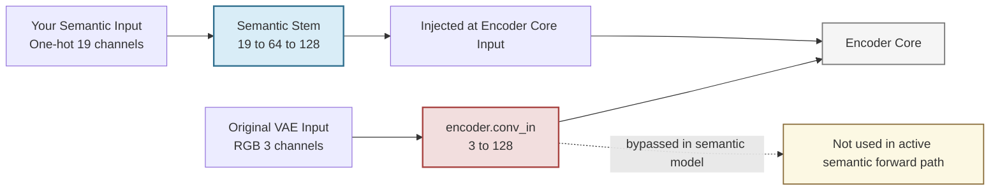
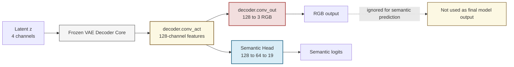
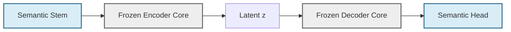

# Semantic-Native VAE Visual Diagram

This file provides a visual representation of the architecture described in `SEMANTIC_VAE_ARCHITECTURE_REPORT.md`.

## 1. Full Architecture Overview

```mermaid
flowchart TD
    A[Semantic ID Clip<br/>B x T x H x W] --> B[Flatten Time into Batch<br/>B*T x H x W]
    B --> C[One-Hot Encoding<br/>B*T x 19 x H x W]

    C --> D[Semantic Stem<br/>Conv2d 19 to 64<br/>GroupNorm<br/>SiLU<br/>Conv2d 64 to 128]
    D --> E[Semantic Features h0<br/>B*T x 128 x H x W]

    E --> F[Bypass Original Encoder conv_in 3 to 128]
    F --> G[Frozen VAE Encoder Core]

    subgraph ENC[Pretrained VAE Encoder Core]
        G1[down_blocks x4]
        G2[mid_block]
        G3[conv_norm_out]
        G4[conv_act]
        G5[conv_out to 8 channels]
        G1 --> G2 --> G3 --> G4 --> G5
    end

    G --> G1
    G5 --> H[Split Latent Params]
    H --> H1[Mean<br/>B*T x 4 x H/8 x W/8]
    H --> H2[Logvar<br/>B*T x 4 x H/8 x W/8]
    H1 --> I[Use Mean as z]

    I --> J[Decode Each Frame Independently<br/>num_frames = 1]

    subgraph DEC[Pretrained VAE Decoder Core]
        J1[decoder internal latent projection]
        J2[decoder.conv_in]
        J3[mid_block]
        J4[up_blocks]
        J5[conv_norm_out]
        J6[conv_act]
        J7[conv_out 128 to 3 RGB]
        J1 --> J2 --> J3 --> J4 --> J5 --> J6 --> J7
    end

    J --> J1
    J6 --> K[Feature Tap Before RGB Projection<br/>B*T x 128 x H x W]
    J7 --> X[RGB Output Exists Internally<br/>But Is Ignored]

    K --> L[Reshape Back to Clip<br/>B x T x 128 x H x W]
    L --> M[Semantic Head<br/>Conv3d 128 to 64<br/>GroupNorm<br/>SiLU<br/>Conv3d 64 to 19]
    M --> N[Semantic Logits<br/>B x T x 19 x H x W]
    N --> O[Argmax]
    O --> P[Predicted Semantic IDs<br/>B x T x H x W]

    style D fill:#d9edf7,stroke:#31708f,stroke-width:2px
    style M fill:#d9edf7,stroke:#31708f,stroke-width:2px
    style ENC fill:#f5f5f5,stroke:#777,stroke-width:1.5px
    style DEC fill:#f5f5f5,stroke:#777,stroke-width:1.5px
    style F fill:#fcf8e3,stroke:#8a6d3b,stroke-width:2px
    style X fill:#f2dede,stroke:#a94442,stroke-width:2px
```

## 2. Encoder Surgery View

This diagram focuses on how the semantic stem replaces the original RGB entry path.

## 3. Decoder Surgery View

This diagram focuses on how the semantic head replaces the RGB output path for prediction.

## 4. Trainable vs Frozen Blocks

Legend:

- blue: trainable custom semantic modules
- gray: frozen pretrained VAE modules
- yellow: feature tap or bypass point
- red: original RGB-specific path not used as the semantic prediction output

## 5. Compact Thesis Figure Caption

You can use this caption with the diagram:

> Overview of the proposed semantic-native VAE. A one-hot semantic clip is first mapped by a trainable 2D semantic stem into a 128-channel feature space compatible with the pretrained Stable Video Diffusion VAE encoder. The original encoder input projection is bypassed, while the encoder core remains frozen. The latent mean is decoded frame-wise by the frozen pretrained decoder, and 128-channel decoder features are extracted immediately before the RGB projection layer. A trainable 3D semantic head then aggregates clip features and predicts 19 semantic logits per frame.

